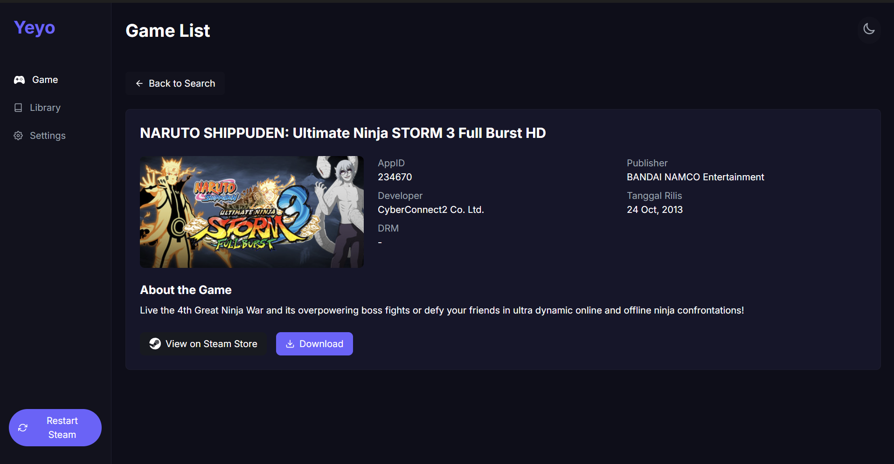
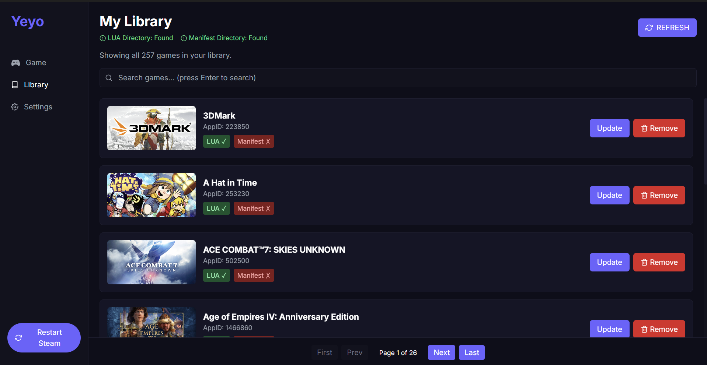

# Oracle Downloader

<p align="center">
  
</p>

<p align="center">
  <strong>A powerful Steam game data downloader with a modern interface</strong>
</p>

<p align="center">
  <a href="#screenshots">Screenshots</a> •
  <a href="#features">Features</a> •
  <a href="#how-it-works">How It Works</a>
</p>

Oracle Downloader is a cross-platform application built with Rust and Tauri that allows you to download game data from GitHub repositories using Steam AppIDs. It features a modern React-based UI with a dark theme and provides an intuitive way to search, download, and manage game files.

## Screenshots

<p align="center">
  
  &nbsp;&nbsp;
  
</p>

<p align="center">
  
</p>

## Features

- **Modern UI**: Clean, responsive interface with dark theme
- **Game Search**: Search games by name or AppID
- **Game Details**: View detailed information about games
- **Download Management**: Download game data directly from GitHub repositories
- **Library View**: Browse and manage your downloaded games
- **Persistent Settings**: Save your preferred download directory
- **Steam Integration**: Restart Steam directly from the app
- **Multiple Repository Support**: Downloads from various GitHub repositories
- **Cross-Platform**: Works on Windows, macOS, and Linux

## How It Works

1. The application searches for games using the Steam API
2. When downloading, it attempts to fetch data from multiple GitHub repositories
3. Downloaded files are stored in your configured directory
4. The application extracts and processes the files for use with Steam
5. Files are automatically moved to the appropriate Steam directories:
   - LUA files: `C:\Program Files (x86)\Steam\config\stplug-in`
   - Manifest files: `C:\Program Files (x86)\Steam\config\depotcache`
   - BIN files: `C:\Program Files (x86)\Steam\config\StatsExport`

## Technologies Used

- **Frontend**: React, TailwindCSS
- **Backend**: Rust, Tauri
- **APIs**: Steam API, GitHub API
- **Libraries**:
  - tokio - Asynchronous runtime
  - reqwest - HTTP client
  - serde - Serialization/deserialization
  - walkdir - Directory traversal
  - once_cell - Global state management

## Installation

### Prerequisites

- [Rust](https://rustup.rs/) (latest stable version)
- [Node.js](https://nodejs.org/) (v16 or higher)
- [Git](https://git-scm.com/)
- [Visual Studio Build Tools](https://visualstudio.microsoft.com/visual-cpp-build-tools/) (Windows only)
- [WebView2](https://developer.microsoft.com/en-us/microsoft-edge/webview2/) (Windows only)

### Quick Start (For Users)

1. Download the latest release from the [Releases](https://github.com/Nazril08/SourceOracle/releases) page
2. Extract the downloaded archive
3. Run the installer (Windows) or the application (macOS/Linux)

### Development Setup

1. Clone the repository:
   ```bash
   git clone https://github.com/Nazril08/SourceOracle.git
   cd SourceOracle
   ```

2. Install Rust dependencies and build the backend:
   ```bash
   cargo build
   ```

3. Navigate to the Tauri app directory and install frontend dependencies:
   ```bash
   cd tauri-app
   npm install
   ```

4. Start the development server:
   ```bash
   npm run tauri dev
   ```

### Building for Production

To create a production build:

1. Navigate to the Tauri app directory:
   ```bash
   cd tauri-app
   ```

2. Create a production build:
   ```bash
   npm run tauri build
   ```

The built application will be available in `tauri-app/src-tauri/target/release`.

### Common Issues and Solutions

1. **Windows Build Errors**
   - Ensure Visual Studio Build Tools is installed with the "Desktop development with C++" workload
   - Make sure WebView2 is installed

2. **Rust Compilation Errors**
   - Update Rust: `rustup update stable`
   - Clean build: `cargo clean && cargo build`

3. **Node.js Dependencies Issues**
   - Clear npm cache: `npm cache clean --force`
   - Delete node_modules and reinstall: `rm -rf node_modules && npm install`

## License

This project is licensed under the MIT License.

## Acknowledgments

- [Steam API](https://steamcommunity.com/dev) for game data
- [Tauri](https://tauri.app/) for the application framework
- [React](https://reactjs.org/) for the frontend framework
- [TailwindCSS](https://tailwindcss.com/) for styling 